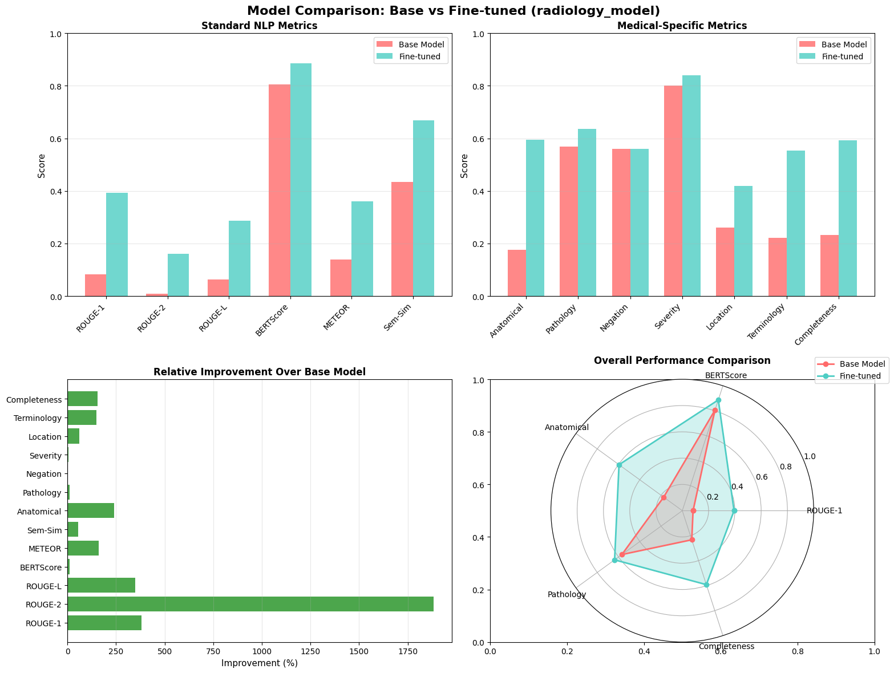
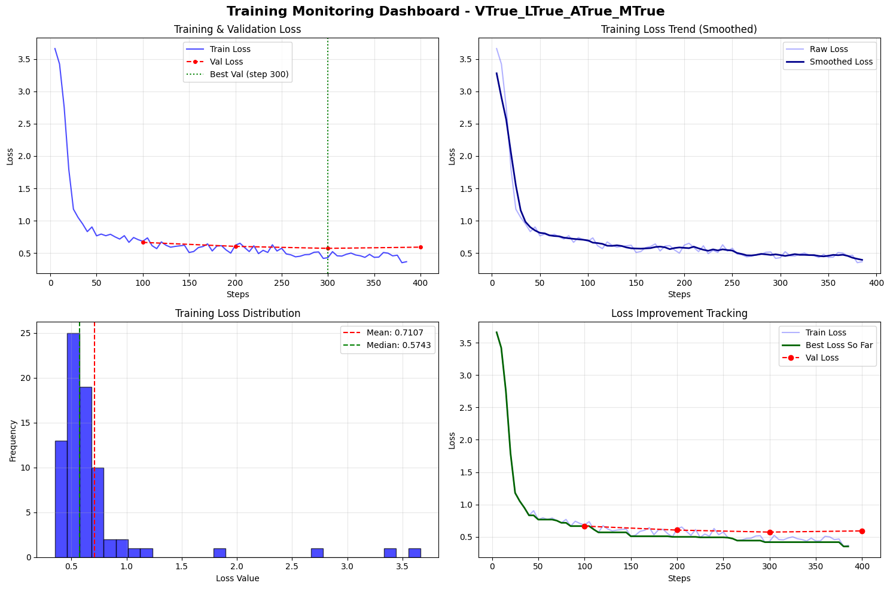

# Medical Report Generation from Radiology Images

This project fine-tunes the Llama 3.2-11B-Vision-Instruct model using LoRA (Low-Rank Adaptation) to generate comprehensive & detailed radiology reports from medical images. The model learns to identify anatomical structures, detect pathological findings, and produce detailed clinical descriptions.

Training dataset = [maomao1234/r1_report_generation]([https://x.ai](https://huggingface.co/datasets/maomao1234/r1_report_generation)) from hugging face

## Highlights
- LoRA Fine-tuning: Efficient parameter-efficient training
- 4-bit Quantization: Reduced memory footprint using bitsandbytes
- Gradient Checkpointing: Memory-efficient training
- Early Stopping: Automatic training termination based on validation loss
- Overfitting Detection: Monitors train-validation loss gap
- Comprehensive Monitoring: Real-time tracking of loss, learning rate, and GPU memory
- Extensive evaluation with medical specific metrics:
  - Standard NLP Metrics: ROUGE-1, ROUGE-2, ROUGE-L, BERTScore, METEOR
  
  Medical-Specific Metrics:
  -Anatomical structure F1 score
  -Pathology classification accuracy
  -Negation handling accuracy
  -Severity matching accuracy
  -Location accuracy
  -Medical terminology coverage
  -Report completeness

## Results

  

Training Monitoring

  

